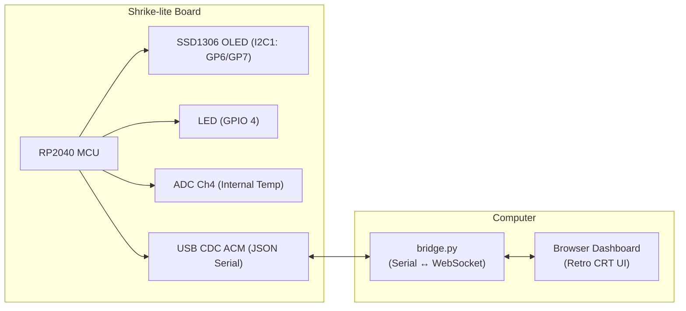

# shrikeOS Monitor

A dashboard system monitor for the [shrike-lite board](https://vicharak-in.github.io/shrike/introduction.html) (RP2040 + SLG47910 FPGA) built on Zephyr RTOS. Working with Zephyr for the first time so didn't took that many risks.

### Architecture



## File Structure

```
~/zephyrproject/shrike_monitor/
├── CMakeLists.txt                 # zephyr build config
├── prj.conf                      # Kconfig
├── boards/
│   └── rpi_pico.overlay           # overall layout for the pins
├── src/
│   └── main.c                    # 4 threads
└── dashboard/
    ├── index.html                 # dashboard layout
    ├── style.css                  # css
    ├── app.js                     # websocket client
    └── bridge.py                  # serial to websocket bridge
```


### I2C Display Layout

```
┌────────────────────────┐
│      SHRIKE            │ ← yellow zone (dual-color atleast the one I used)
├────────────────────────┤
│ LED: ON                │ ← LED state
│                        │
│ > Ready                │ ← custom message area
│                        │   (shows typed msg from dashboard)
└────────────────────────┘
```

### Web-based Monitor


